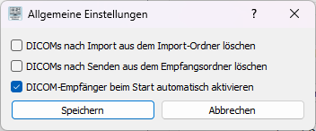
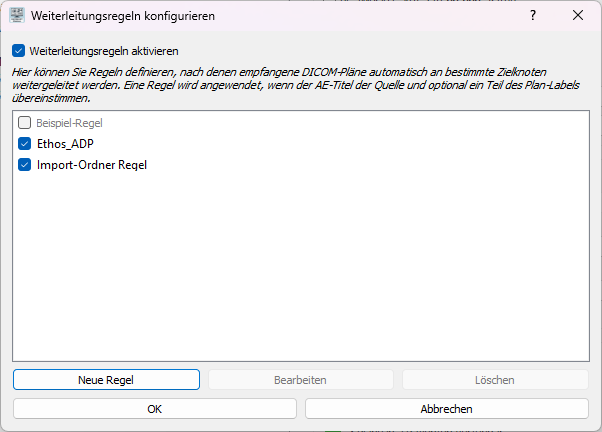

# DICOM RT Station
A comprehensive DICOM RT (Radiation Therapy) plan management application with graphical user interface. This software enables receiving, organizing, and selectively forwarding DICOM RT plans to various DICOM nodes with automated rule-based forwarding capabilities.


*Main interface showing received plans and forwarding options*

## Use Cases

- Hospitals/clinics that routinely send DICOM-RT datasets (CT, RS, RP, RD) and want to forward to multiple destinations (TPS, archive, QA, research) in one flow.
- Control which plans to forward when a source system sends too many or in the wrong order (e.g., Ethos scheduled and adaptive plans). Use label filters like "ADP" to forward only adaptive plans.
- Normalize routing behavior across mixed vendors by matching on Source AE and plan label substrings.
- Batch-import historical studies from a folder and auto-forward to downstream systems.
- Reduce manual overhead while keeping full visibility via logs and progress indicators.

## Features

### Core Functionality
- **DICOM Network Receiver**: Receives DICOM files over the network and automatically organizes them into patient/plan folders
- **Plan Management**: Displays all received plans in an organized tree view with patient information
- **Selective Forwarding**: Send selected plans to configurable DICOM nodes
- **Multi-Target Support**: Send plans to multiple destinations simultaneously
- **Import Folder Processing**: Process DICOM files from local folders

### Advanced Features
- **Automated Rule-Based Forwarding**: Configure rules to automatically forward plans based on source AE title and plan name patterns
- **Dual Forwarding Modes**:
  - **Network Receive Mode**: Automatic forwarding when plans are received via DICOM network
  - **Import Folder Mode**: Automatic forwarding when processing local import folders
- **Pixel Data Preservation**: Maintains complete pixel data for RTDOSE, CT, and other imaging modalities
- **Multi-Plan Operations**: Send multiple plans in batch operations
- **Comprehensive Logging**: Detailed logging with configurable verbosity levels

## Installation

### Prerequisites

- **Python 3.7+** (recommended: Python 3.11)
- **pip** (Python package manager)
- **Windows/Linux/macOS** (tested primarily on Windows)

### Quick Start

1. **Clone the repository**:
```bash
git clone https://github.com/yourusername/dicom-rt-station.git
cd dicom-rt-station
```

2. **Install dependencies**:
```bash
pip install -r requirements.txt
```

3. **Run the application**:
```bash
python main.py
```

The application will automatically create default configuration files on first run.

## Configuration

### Settings Configuration (`settings.ini`)

The main configuration is managed through `settings.ini`, which is automatically created on first startup. You can edit settings through the GUI (**File > Settings**) or directly edit the file.



*Settings dialog for configuring DICOM nodes and application behavior*

#### Key Settings Sections:

**[General]**
```ini
watch_folder = d:\received_plans          # Where received plans are stored
import_folder = d:\import                  # Folder for manual import processing
clear_import_folder_after_import = True   # Auto-delete import folder after processing
```

**[Receiver]**
```ini
ae_title = DICOM-RT-STATION              # Your application's AE title
port = 11112                             # Port for receiving DICOM connections
```

**[Logging]**
```ini
verbose_info_logging = True              # Enable detailed status logging
```

**[Node1], [Node2], [Node3]** - Configure up to 3 or more target DICOM nodes:
```ini
[Node1]
name = ORGANO
enabled = True
ae_title = ORGANO
ip = 192.168.1.100
port = 104
called_ae_title = ORGANO
calling_ae_title = DICOM-RT-STATION
```

### Forwarding Rules Configuration (`rules.ini`)

Configure automated forwarding rules through the **Rules** dialog accessible from the main menu.



*Rules dialog for configuring automatic forwarding rules*

#### Rule Types:

1. **Network Receive Rules**: Forward plans received via DICOM network
   - **Source AE**: Match specific sending AE title (e.g., "FOLLOW")
   - **Plan Label Match**: Forward only plans containing specific text (e.g., "ADP")
   - **Target Nodes**: Destination nodes for forwarding

2. **Import Folder Rule**: Forward all plans processed via import folder
   - **Source AE**: Set to "IMPORT_FOLDER" (automatic)
   - **Plan Label Match**: Leave empty to forward all plans
   - **Target Nodes**: Destination nodes for forwarding

#### Example Rules:
```ini
[Rule1]
name = Ethos ADP Plans
enabled = True
source_ae = FOLLOW
target_nodes = ORGANO
plan_label_match = ADP

[Rule2]
name = Import Folder Rule
enabled = True
source_ae = IMPORT_FOLDER
target_nodes = ORGANO
plan_label_match =
```

Note: `plan_label_match` uses substring matching. If left empty, all plans matching the rule's source AE will be forwarded.

## Usage

### Starting the Application

1. **Launch the application**:
```bash
python main.py
```

2. **Start DICOM Receiver** (if receiving network data):
   - Click **"DICOM-Empfänger starten"** button
   - Status will show "Empfänger läuft" when active

### Receiving DICOM Plans

**Network Reception:** Plans received via DICOM are organized by patient and shown in the tree view. If rules are enabled, matching plans are forwarded automatically.

**Import Folder Processing:** Place DICOM files in the configured folder and click **"Import Ordner verarbeiten"**. Files are organized; optional auto‑cleanup can clear the folder after processing.

### Manual Plan Forwarding

1. **Select Plans**: Check the boxes next to plans you want to send
2. **Select Target Nodes**: Enable checkboxes for destination nodes (Node1, Node2, Node3)
3. **Send Plans**: Click **"Senden"** button
4. **Monitor Progress**: Watch the status bar for sending progress

### Viewing Plan Details

- **Plan Information**: Click on any plan to view details in the right panel
- **File Contents**: See all DICOM files included in each plan (RTPLAN, RTDOSE, RTSTRUCT, CT)
- **Patient Data**: View patient ID, name, and plan metadata

## Advanced Features

### Automated Forwarding Workflows

**Scenario 1: Network Receive with Selective Forwarding**
- Configure rule: Source AE = "FOLLOW", Plan Label = "ADP"
- When plans containing "ADP" are received from "FOLLOW", they're automatically sent to configured nodes
- Other plans are received but not forwarded

**Scenario 2: Import Folder with Universal Forwarding**
- Configure IMPORT_FOLDER rule with empty plan label match
- All plans processed via import folder are automatically forwarded
- Useful for batch processing of archived plans

### Logging and Monitoring

**Log Files**: Located in `logs/` directory with timestamp-based filenames

**Log Levels**:
- **INFO**: General operation status
- **DEBUG**: Detailed technical information
- **ERROR**: Error conditions and failures

**Key Log Events**:
- Plan reception and organization
- Forwarding rule evaluation
- Sending operations and results
- File operations and pixel data preservation

## Troubleshooting

### Common Issues

**Plans not forwarding automatically:**
- Check that forwarding rules are enabled in `rules.ini`
- Verify source AE title matches exactly
- Check plan label matching criteria
- Review logs for rule evaluation details

**DICOM sending failures:**
- Verify target node configuration (IP, port, AE titles)
- Check network connectivity
- Ensure target node is accepting connections
- Review DICOM association logs

**Import folder not processing:**
- Verify import folder path in settings
- Check file permissions
- Ensure DICOM files are valid
- Review processing logs for errors

### Log Analysis

Enable verbose logging in `settings.ini`:
```ini
[Logging]
verbose_info_logging = True
```

Key log patterns to look for:
- `"Prüfe Weiterleitungsregeln"` - Rule evaluation
- `"Plan X erfolgreich an Y weitergeleitet"` - Successful forwarding
- `"RTDOSE copied"` - Pixel data preservation
- `"Association Released"` - DICOM network operations

## File Structure

```
dicom-rt-station/
├── main.py                    # Main application entry point
├── dicom_processor.py         # Core DICOM processing logic
├── rules_manager.py           # Forwarding rules management
├── settings_manager.py        # Configuration management
├── settings_dialog.py         # Settings GUI
├── rules_dialog.py           # Rules configuration GUI
├── requirements.txt          # Python dependencies
├── settings.ini              # Main configuration (auto-created)
├── rules.ini                 # Forwarding rules (auto-created)
├── logs/                     # Application logs
├── received_plans/           # Organized received plans can be changed in settings.ini
└── import/                   # Import folder for processing can be changed in settings.ini
```

## Roadmap (Planning)

- **Plan Metrics Database**: Lightweight SQLite service that stores key DICOM‑RT metrics per plan/patient for search and QA.
  - Patient/Plan identifiers, Source AE, timestamps
  - RTPLAN: beams, energies, MUs, fractions, prescription
  - RTDOSE: dose grid info, statistics (min/mean/max), DVH pre‑computations for key structures
  - RTSTRUCT: structure set summary (names, counts)
  - Indexing for fast lookups and rule analytics
- **Metrics UI & API**: In‑app table and REST API to filter/export plans based on metrics (e.g., “all ADP plans with max dose > X”).
- **Enhanced Rules Actions**: Optional actions per rule: rename/normalize plan labels, archive to PACS, anonymize, compress/ZIP, tag in DB.
- **Unlimited Target Nodes**: GUI for managing an arbitrary number of DICOM nodes (beyond Node1‑3) with grouping and priorities.
- **Queue & Retry Engine**: Persistent job queue with backoff, per‑node rate limits, and resumable sends.
- **Audit & Reporting**: End‑to‑end audit trail, per‑rule success rates, monthly export (CSV/JSON), and log viewer.
- **Advanced Imports**: ZIP import, recursive folder watch with include/exclude filters, checksum deduplication.
- **Auto‑Cleanup Policies**: Time/size‑based retention for received_plans and logs with safe guardrails.
- **Plugin Hooks**: Pre/post‑processing hooks for custom scripts (e.g., structure renaming, private tag handling).

## Contributing

1. Fork the repository
2. Create a feature branch (`git checkout -b feature/amazing-feature`)
3. Commit your changes (`git commit -m 'Add amazing feature'`)
4. Push to the branch (`git push origin feature/amazing-feature`)
5. Open a Pull Request

## License

This project is licensed under the MIT License - see the [LICENSE](LICENSE) file for details.

## Support

For issues, questions, or contributions:
- **GitHub Issues**: [Report bugs or request features](https://github.com/yourusername/dicom-rt-station/issues)
- **Logs**: Enable verbose logging for troubleshooting

---

**DICOM RT Station** - Professional DICOM RT plan management made simple.
